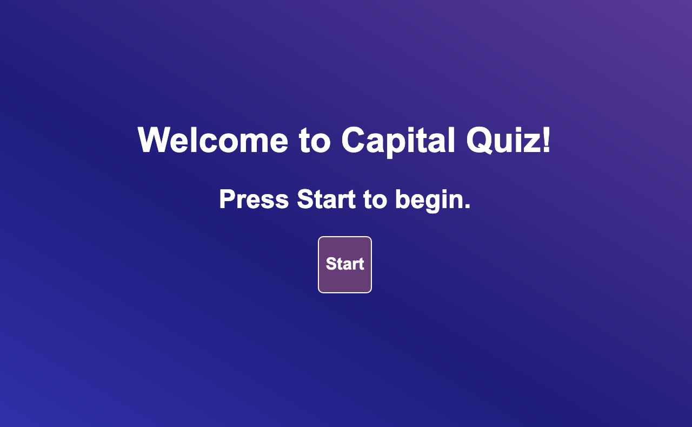
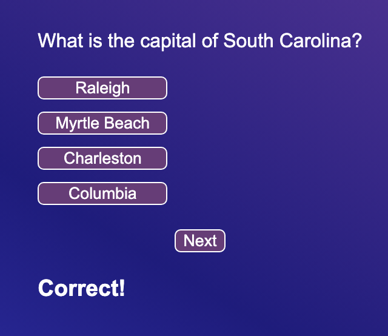

# Colin Whitcomb

## Deployed Site
1) https://colin-whitcomb.github.io/code-quiz/ 
___
## Summary & Process

In this assignment our objective was to create a quiz game.

I started by organizing the HTML and the corresponding Javascript to iterate through questions. I later focused on the timer function, and lastly on the high score documentation. CSS design was done between large projects. 

In addition to the required components, I made sure to add "Correct!" and "Wrong!" messages to notify the user the accuracy of their answer (seen in screen-shot2) as well as decrementing the time left per every wrong answer. 
___
## Screenshots
**Screen shot-1**

**Screen shot-2**

___
## Technologies / Resources
- Javascript
- CSS / HTML 
- Visual Studio Code
- Git / GitHub / GitPages

- The following video was also quite instructive: 
https://www.youtube.com/watch?v=riDzcEQbX6k

___
## Author

**Colin Whitcomb** [LinkedIn](https://ww.linkedin.com/in/colin-whitcomb-b808301a6/)

___